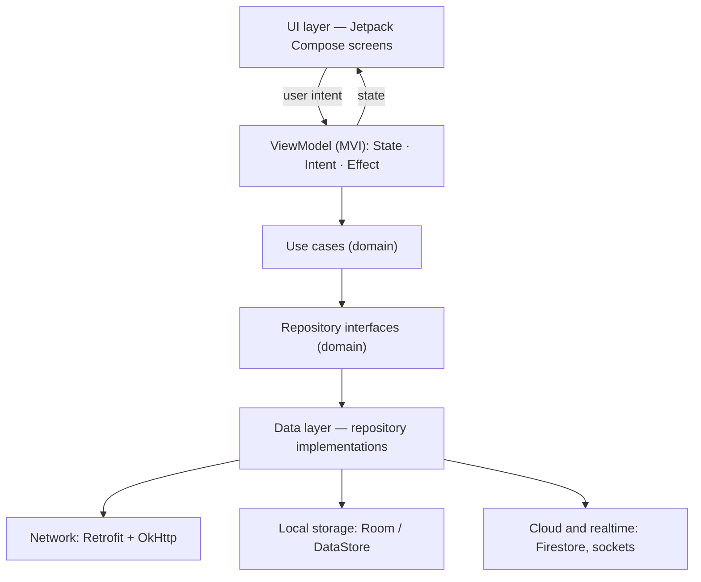
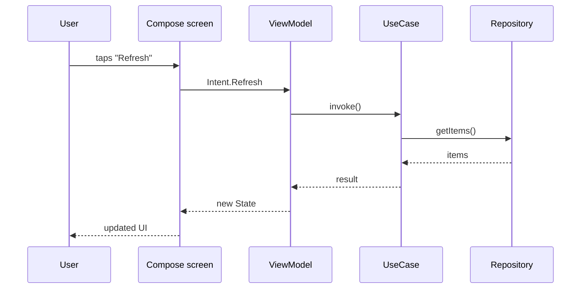

# Production app architecture (generic)

!!! note "Fill this in from memory"
    This page is a skeleton. Replace the labels with how a real production app you worked on is structured — **generic names only**: no company code, no internal URLs, no keys, no private data. Delete this note when done.

## Layers

## One screen, end to end

## Key decisions

| Decision | Why | What I gave up |
|---|---|---|
| MVI instead of MVVM | One immutable state per screen; predictable | More boilerplate |
| Single navigation entry point | All deep links in one place | Extra indirection |
| _add yours_ | | |

## What I would change today

-
